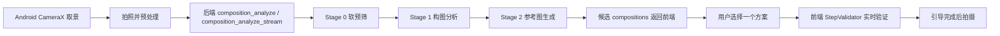

# PhotoFramer

PhotoFramer 是一个面向“辅助拍摄 / 构图引导”的实验项目：用户先拍一张当前场景图，后端给出多个可行构图方案与参考图，Android 客户端再根据这些目标构图做实时闭环引导，帮助用户把手机取景调整到更接近目标效果。

当前仓库里最重要的两条主线是：

- `android_frontend`：Android 前端，负责相机预览、拍照、候选展示、实时引导与最终拍摄
- `pc_demo_parallel_two_stage_new`：新的后端主干，虽然目录名带 `two_stage_new`，但当前实际运行架构已经是 Stage 0 / Stage 1 / Stage 2 三阶段流水线

## 仓库里有什么

```text
PhotoFramer
├── android_frontend                  # Android 客户端
├── pc_demo_parallel_two_stage_new    # 三阶段后端主干
├── API_access_tests                  # 接口侧实验/验证脚本
├── Gemini_prompt_tests               # Prompt 试验记录
├── docs                              # 仓库内文档
└── test_images                       # 测试图片
```

## 核心能力

- AI 构图分析：对当前照片评估哪些构图 technique 适用
- 多候选输出：针对不同 technique 返回步骤化建议与参考图
- 流式结果返回：后端支持 SSE，将候选逐个推送给前端
- 实时本地验证：前端结合 OpenCV、ML Kit、ARCore/姿态信息做闭环引导
- 画面内构图：支持基于裁切推荐的“画面内重构图”模式

## 系统结构



从职责上看：

- 后端负责“生成目标构图”
- 前端负责“把当前画面拉向目标构图”

## 技术栈概览

### Android 端

- Kotlin + Jetpack Compose
- CameraX
- Lifecycle + ViewModel + StateFlow
- Retrofit + OkHttp
- OpenCV
- ML Kit Object Detection
- ARCore（可选增强链）

### 后端

- Python + FastAPI
- Pydantic
- `google-genai`
- DashScope / OpenAI-compatible client
- Pillow
- SSE（`StreamingResponse`）

## 快速开始

### 1. 启动后端

详细说明见 [pc_demo_parallel_two_stage_new/README.md](./pc_demo_parallel_two_stage_new/README.md)。

最小步骤：

```bash
cd pc_demo_parallel_two_stage_new
pip install -r requirements.txt

# 以官方 Gemini 为例
export GEMINI_API_KEY=your_key
export USE_GEMINI_PROXY=false

uvicorn main:app --host 0.0.0.0 --port 8100 --reload
```

启动后可访问：

- `http://localhost:8100/docs`
- `http://localhost:8100/health`

### 2. 配置 Android 前端指向后端

详细说明见 [android_frontend/README.md](./android_frontend/README.md)。

默认情况下，前端代码里的：

- `AI_COMPOSITION_URL` 指向公网地址 `http://aicrop.312237.xyz/`
- `IN_FRAME_COMPOSITION_URL` 指向外部裁切服务 `https://crop2.312237.xyz/predict?return_preview=0`

如果你要联调本地后端，请修改：

- `android_frontend/app/src/main/java/com/photoframer/data/api/ApiConfig.kt`

如果你在 Android 模拟器里访问本机后端，可用：

```kotlin
const val AI_COMPOSITION_URL = "http://10.0.2.2:8100/"
```

如果你在真机上访问本机后端，请改成电脑局域网 IP，例如：

```kotlin
const val AI_COMPOSITION_URL = "http://192.168.1.20:8100/"
```

### 3. 运行 Android 客户端

```text
用 Android Studio 打开 android_frontend
-> 等待 Gradle Sync
-> 连接真机或启动模拟器
-> Run
```

## 推荐阅读顺序

如果你第一次接手这个仓库，推荐按这个顺序看：

1. 本 README
2. [android_frontend/README.md](./android_frontend/README.md)
3. [pc_demo_parallel_two_stage_new/README.md](./pc_demo_parallel_two_stage_new/README.md)
4. `android_frontend/app/src/main/java/com/photoframer/ui/screens/CameraScreen.kt`
5. `android_frontend/app/src/main/java/com/photoframer/viewmodel/CameraViewModel.kt`
6. `pc_demo_parallel_two_stage_new/routers/composition.py`
7. `pc_demo_parallel_two_stage_new/services/common.py`

## 关键事实和注意事项

- `pc_demo_parallel_two_stage_new` 虽然名字还保留 “two_stage”，但代码已经是三阶段结构
- Android 前端默认优先走流式接口，流式失败后再回退普通接口
- 画面内构图服务当前是外部 URL，不在本仓库内
- 后端读取环境变量时当前没有自动 `load_dotenv()`，请直接在 shell 中 `export`
- Android 端当前声明了 Coil 依赖，但主干实现的核心图片显示并不依赖它

## 文档入口

- Android 端详细说明：[android_frontend/README.md](./android_frontend/README.md)
- 后端详细说明：[pc_demo_parallel_two_stage_new/README.md](./pc_demo_parallel_two_stage_new/README.md)

## 当前适合谁看

这个仓库的 README 主要是写给三类人：

- 要快速把项目跑起来的人
- 要继续开发 Android 前端或后端的人
- 要基于这套代码写论文、做答辩、整理架构说明的人

如果你的目标是快速定位主逻辑，先抓住一句话：

> 后端负责产出候选构图目标，前端负责实时验证并引导用户把当前取景调整到这个目标。
