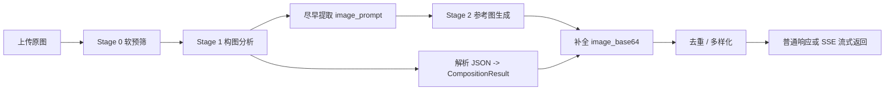

# PhotoFramer Backend - Three-Stage Pipeline

`pc_demo_parallel_two_stage_new` 是当前 PhotoFramer 的后端主干。它虽然沿用了历史目录名 `two_stage_new`，但实际运行架构已经是三阶段流水线：

- Stage 0：候选构图技术软预筛
- Stage 1：构图分析、步骤生成与 `image_prompt` 产出
- Stage 2：参考构图图生成

这套后端的目标不是做最终拍摄验证，而是为前端持续产出“值得尝试的目标构图方案”。

## 这套后端做什么

输入是一张当前场景图，输出是若干个 `CompositionResult`。每个候选里通常包含：

- `technique`
- `technique_name`
- `aesthetic_desc`
- `steps`
- `shot_spec`
- `image_prompt`
- `image_base64`
- `timing`

也就是说，后端输出的不只是“这张图适合三分构图”，而是：

- 适不适合
- 为什么适合
- 用户该怎么挪手机
- 目标画面大致长什么样

## 架构概览



## 当前支持的构图 technique

来自 `config.py` 的默认 technique 列表：

- `rule_of_thirds`
- `center_composition`
- `leading_lines`
- `foreground_framing`
- `diagonal_composition`

## Provider 组合方式

每个阶段都可以单独切换 provider：

- Stage 0：`gemini` / `qwen`
- Stage 1：`gemini` / `qwen`
- Stage 2：`gemini` / `qwen`

因此可以自由组合，例如：

- `gemini -> gemini -> gemini`
- `gemini -> gemini -> qwen`
- `qwen -> qwen -> gemini`
- `qwen -> gemini -> gemini`

当前默认值偏向 Gemini 组合，主要是为了避免 Qwen 图像侧的官方速率限制影响默认体验。

## 目录结构

```text
pc_demo_parallel_two_stage_new
├── main.py
├── config.py
├── requirements.txt
├── routers
│   ├── composition.py
│   └── image.py
├── schemas
│   ├── composition.py
│   └── image.py
├── services
│   ├── __init__.py
│   ├── common.py
│   ├── stage0_gemini_provider.py
│   ├── stage0_qwen_provider.py
│   ├── stage1_gemini_provider.py
│   ├── stage1_qwen_provider.py
│   ├── stage2_gemini_provider.py
│   ├── stage2_qwen_provider.py
│   ├── gemini_client_factory.py
│   ├── gemini_profiles.py
│   └── prompt_adapters.py
├── prompts
│   ├── stage0_soft_prefilter.md
│   ├── stage1_system_instruction.md
│   └── techniques
└── tests
    └── test_pipeline_guards.py
```

## 关键设计点

### 1. Prompt 资产化

提示词不写死在 provider 里，而是放在：

- `prompts/stage1_system_instruction.md`
- `prompts/stage0_soft_prefilter.md`
- `prompts/techniques/*.md`

这样做的好处是：

- 更方便调 prompt
- 更方便记录实验
- 更适合做论文/答辩里的方法说明

### 2. 流式 prompt 前置

当前 Gemini 和 Qwen 的 Stage 1 都支持在流式输出中尽早抽取 `image_prompt`。这意味着：

- 不需要等 Stage 1 全部结束
- 只要 `image_prompt` 出来了
- Stage 2 就可以提前启动

这是这套后端降低总时延的关键优化之一。

### 3. Provider 适配层

不同模型的调用细节被封装在 provider 层：

- Qwen 文本阶段用 OpenAI-compatible client
- Qwen 图像阶段用 DashScope
- Gemini 用 `google-genai`

路由层不直接关心这些差异，只通过 `get_stage0_service()`、`get_stage1_service()`、`get_stage2_service()` 取服务实例。

### 4. 输出契约统一

不同 provider 返回的格式并不完全一样，但最后都会被收敛成统一的 schema：

- `AnalysisResponse`
- `CompositionResult`
- `ImageGenerationResponse`

前端只需要理解统一格式，不需要知道当前后端跑的是 Qwen 还是 Gemini。

## 运行环境要求

- Python 3.10+
- 可访问相应模型服务的网络环境
- 如使用官方 Gemini，可能需要代理

## 安装

```bash
cd pc_demo_parallel_two_stage_new
pip install -r requirements.txt
```

依赖包括：

- `fastapi`
- `uvicorn[standard]`
- `python-multipart`
- `openai`
- `pillow`
- `python-dotenv`
- `dashscope`
- `google-genai`

注意：

- 当前代码里没有自动调用 `load_dotenv()`，因此请直接在 shell 中 `export` 环境变量，或者由你的运行器负责注入环境变量

## 最小可运行配置

### 方案一：官方 Gemini

```bash
export STAGE0_PROVIDER=gemini
export STAGE1_PROVIDER=gemini
export STAGE2_PROVIDER=gemini

export GEMINI_API_KEY=your_key
export USE_GEMINI_PROXY=false
```

如果你的网络环境访问官方 Gemini 需要代理，可以改成：

```bash
export USE_GEMINI_PROXY=true
export GEMINI_PROXY_URL=http://127.0.0.1:11087
```

### 方案二：国内 Gemini 兼容中转

```bash
export STAGE0_PROVIDER=gemini
export STAGE1_PROVIDER=gemini
export STAGE2_PROVIDER=gemini

export USE_GEMINI_DOMESTIC_API=true
export GEMINI_DOMESTIC_BASE_URL=https://your-proxy-root.example.com
export GEMINI_DOMESTIC_API_KEY=your_key
export GEMINI_DOMESTIC_API_VERSION=v1beta
```

注意：

- `GEMINI_DOMESTIC_BASE_URL` 填服务根地址或 API 根地址
- 不要填到某个完整 `generateContent` 路径

### 方案三：Qwen / 混合 Provider

```bash
export STAGE0_PROVIDER=qwen
export STAGE1_PROVIDER=qwen
export STAGE2_PROVIDER=gemini

export DASHSCOPE_API_KEY=your_dashscope_key
export GEMINI_API_KEY=your_gemini_key
export USE_GEMINI_PROXY=false
```

## 常用环境变量

### Provider 选择

```bash
export STAGE0_PROVIDER=gemini
export STAGE1_PROVIDER=gemini
export STAGE2_PROVIDER=gemini
```

### 模型选择

```bash
export QWEN_STAGE0_MODEL=qwen3.6-flash-2026-04-16
export QWEN_STAGE1_MODEL=qwen3.6-flash-2026-04-16
export QWEN_STAGE2_MODEL=qwen-image-2.0-2026-03-03

export GEMINI_STAGE0_MODEL=gemini-3.1-flash-lite
export GEMINI_STAGE1_MODEL=gemini-3-flash-preview
export GEMINI_STAGE2_MODEL=gemini-2.5-flash-image
```

### Stage 0

```bash
export ENABLE_STAGE0=false
export STAGE0_MAX_TECHNIQUES=5
export STAGE0_TEMPERATURE=0.1
export STAGE0_TOP_P=0.9
```

### Stage 1 / Stage 2 通用吞吐与超时

```bash
export STAGE1_MAX_CONCURRENCY=5
export STAGE1_TIMEOUT_SECONDS=20
export STAGE2_TIMEOUT_SECONDS=40
```

### 通用采样参数

```bash
export MODEL_TEMPERATURE=0.35
export MODEL_TOP_P=0.80
export MODEL_TOP_K=40
export MODEL_MAX_TOKENS=1024
```

### Gemini 代理相关

```bash
export USE_GEMINI_PROXY=true
export GEMINI_PROXY_URL=http://127.0.0.1:11087
export USE_GEMINI_DOMESTIC_API=false
```

### Qwen 图像侧限速

```bash
export IMAGE_MAX_RATE=2.0
```

## 运行

### 开发模式

```bash
uvicorn main:app --host 0.0.0.0 --port 8100 --reload
```

### 直接运行

```bash
python main.py
```

启动后默认文档地址：

- `http://localhost:8100/docs`
- `http://localhost:8100/redoc`

## 接口列表

### `GET /`

返回当前服务版本、stage provider / model 和 technique 列表。

### `POST /composition_analyze`

普通非流式三阶段入口。

请求：

- `multipart/form-data`
- 字段名：`image`

响应：

- `AnalysisResponse`

### `POST /composition_analyze_stream`

SSE 流式入口，适合前端逐个接收候选结果。

流式事件包括：

- `analysis_started`
- `candidate_ready`
- `technique_skipped`
- `candidate_duplicate_skipped`
- `summary`
- `[DONE]`

### `POST /image_generate`

仅调用当前 `STAGE2_PROVIDER` 做图像生成。

### `GET /health`

健康检查接口，返回当前模型与 technique 列表。

## 示例请求

### 普通分析

```bash
curl -X POST \
  -F "image=@../test_images/sample.jpg" \
  http://127.0.0.1:8100/composition_analyze
```

### 流式分析

```bash
curl -N -X POST \
  -F "image=@../test_images/sample.jpg" \
  http://127.0.0.1:8100/composition_analyze_stream
```

### 仅调用 Stage 2

```bash
curl -X POST http://127.0.0.1:8100/image_generate \
  -H "Content-Type: application/json" \
  -d '{
    "requests": [
      {
        "technique_id": "rule_of_thirds",
        "image_prompt": "Reframe the scene using rule of thirds.",
        "original_image_b64": null
      }
    ]
  }'
```

## 响应特点

返回的 `compositions[]` 统一包含：

- `steps`
- `shot_spec`
- `image_prompt`
- `image_base64`
- `timing`

这就是 Android 前端可以不关心具体 provider 差异的原因。

## 运行时特性

### 1. 上传大小限制

当前最大上传大小约为：

- 12 MB

### 2. 候选去重与多样化

路由层会根据：

- steps 签名
- viewpoint 需求
- 主体中心
- 主体大小
- technique 本身

做近重复判断，避免前端收到一堆非常相似的候选。

### 3. Gemini 模型能力适配

`gemini_profiles.py` 会根据不同 Gemini 模型决定是否下发：

- `top_k`
- `max_output_tokens`
- `image_config`
- `image_size`
- `thinking_config`

这是为了减少不同模型族之间的参数不兼容问题。

## 测试

运行当前可见测试：

```bash
pytest tests/test_pipeline_guards.py
```

## 常见问题

### 1. 为什么明明设置了 `.env`，服务还是读不到 key

因为当前代码没有自动调用 `load_dotenv()`。请直接在 shell 中 `export`，或用你的进程管理器注入环境变量。

### 2. 为什么官方 Gemini 启动时报代理问题

因为 `USE_GEMINI_PROXY` 当前默认值是 `true`。如果你不需要代理，请显式：

```bash
export USE_GEMINI_PROXY=false
```

### 3. 为什么目录叫 `two_stage_new`，README 却一直说三阶段

因为目录名是历史遗留命名，当前代码实际已经明确包含：

- Stage 0 软预筛
- Stage 1 构图分析
- Stage 2 参考图生成

### 4. 为什么前端默认地址和本地端口对不上

因为 Android 前端默认指向的是现有公网部署地址，而本地开发默认端口是：

- `8100`

联调时需要手动改前端 `ApiConfig.kt`。

## 相关文档

- 仓库总说明：[../README.md](../README.md)
- Android 前端说明：[../android_frontend/README.md](../android_frontend/README.md)
